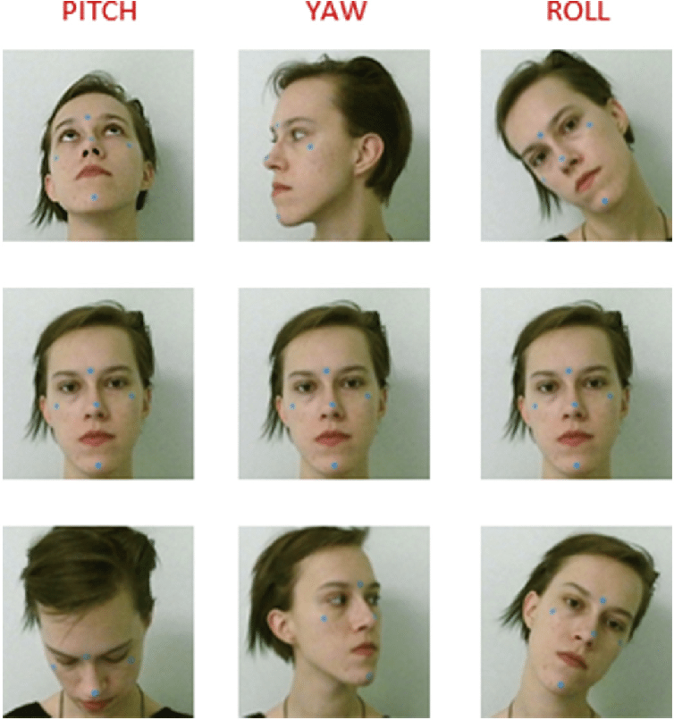

# Launch

In the project's client directory: *liveness-detection/react_client* 
#### run:  
        npm start

Open [http://localhost:3000](http://localhost:3000) to view it in browser.  

# Head pose rotation
Yaw is the rotation around the Y-axis. Pitch around the X-axis, roll around the Z-axis.  

